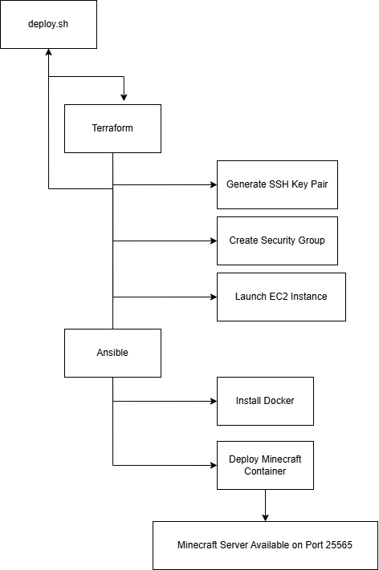

# Automated Mineccraft Server Deployment

## Background

This project automates the process of creating and configuring a Minecraft server on AWS. Instead of manually creating AWS resources and configuring the server, Terraform is used to provision the required cloud infrastructure and Ansible is used to configure the EC2 instance and deploy the Minecraft server.

The deployment process:
* Runs `deploy.sh`, which automates the entire deployment pipeline.
* Uses Terraform to generate an SSH key pair.
* Uses Terraform to create a security group that allows SSH (port 22) and Minecraft traffic (port 25565).
* Uses Terraform to launch an Ubuntu EC2 instance.
* Uses Ansible to connect to the EC2 instance.
* Uses Ansible to install Docker.
* uses Ansible to deploy a Minecraft server using a Docker container.
* Configures the Minecraft container to automatically restart after a reboot.

## Requirements

### AWS Requirements

* AWS Academy Learner Lab account
* Active AWS credentials
* AWS CLI configured

## Pipeline Overview


### Required Software

* Terraform (version 1.13.1 or newer)
* AWS CLI (version 2.35.1 or newer)
* Ansible (version 2.16.3 or newer)
* Git
* Nmap (optional - used to verify the Minecraft port is open)

Docker does not need to be installed locally because it is automatically installed by the Ansible playbook.

## Tutorial

### Step 1: Clone the Repository

Clone the repository and navigate to the project directory.
```bash
git clone https://github.com/miamats04/cs312-minecraft-project
cd minecraft-project2
```

### Step 2: Get AWS CLI Credentials

Navigate to the Learner Lab module page and click on **AWS Details**. Copy the AWS credentials under **AWS CLI**. You should see aws_access_key_id, aws_secret_access_key, and aws_session_token.

In the terminal, configure the AWS CLI:
```bash
aws configure
```

When prompted, enter: 
* AWS Access Key ID
* AWS Secret Access Key
* AWS Session Token
* Default Region: `us-east-1`
* Default Ouput Format: `json`

### Step 3: Run the Deployment Script

```bash
./deploy.sh
```
The deployment script will:
1. Initalize Terraform.
2. Provision the AWS infrastructure.
3. Create the SSH key pair.
4. Launch the EC2 instance.
5. Generate the Ansible inventory file.
6. Run the Ansible playbook.
7. Install Docker.
8. Deploy the Minecraft server container.

### Step 4: Verify the Deployment (Optional)

Verify that the Mincraft port is open using nmap:

```bash
nmap -sV -Pn -p T:25565 <INSTANCE_IP>
```

If the deployment was successful, you will see that the port is open:

```text
25565/tcp open  minecraft Minecraft 26.1.2 
```

## Connecting to the Minecraft Server
1. Launch Minecraft.
2. Select **Multiplayer**.
3. Select **Add Server**.
4. Enter the IP address displayed in the terminal by the deployment script.
5. Append `:25565` if necessary
6. Select **Done** and join the server.

## Resources
* Annysah (June 2026) Connecting AWS with Terraform: A Short Guide [Tutorial/Article]. https://dev.to/aws-builders/connecting-aws-with-terraform-a-short-guide-4bda
* Ansible (June 2026) Ansible Documentation - Inventory [Software Documentation]. https://ansible-doc.readthedocs.io/en/latest/rst/intro_inventory.html
* antonbabenko (June 2026) Terraform security-group [Software Documentation]. https://registry.terraform.io/modules/terraform-aws-modules/security-group/aws/latest 
* Bansikah, N (June 2026) Deploying an AWS EC2 Instance with Terraform and SSH Access [Tutorial/Article]. https://dev.to/bansikah/deploying-an-aws-ec2-instance-with-terraform-and-ssh-access-d09
* CodeGenes (June 2026) How to Programmatically Generate SSH Keys in Terraform for Multiple EC2 Instances: Avoid Manual Creation [Tutorial/Article]. https://www.codegenes.net/blog/how-to-create-an-ssh-key-in-terraform/ 
* Docker-Minecraft-Server (June 2026) Minecraft Server on Docker (Java Edition) [Software Documentation]. https://docker-minecraft-server.readthedocs.io/en/latest/
* Garvit (June 2026) Setting Up an EC2 Instance Using Terraform and SSH Access with PEM Key [Tutorial/Article]. https://medium.com/@garvit1189/setting-up-an-ec2-instance-using-terraform-and-ssh-access-with-pem-key-a2236e0c2fb6
* HashiCorp (June 2026) Create infrastructure [Software Documentation]. https://developer.hashicorp.com/terraform/tutorials/aws-get-started/aws-create
* Kamate, V (June 2026) Automating AWS EC2 Provisioning and Configuration with Terraform and Ansible [Tutorial/Article] https://medium.com/@vrushalkamate/automating-aws-ec2-provisioning-and-configuration-with-terraform-and-ansible-1af1a4ab7ca3 
* nawazdhandala (June 2026) How to Disable SSH Host Key Checking in Ansible [Tutorial/Article] https://oneuptime.com/blog/post/2026-02-21-how-to-disable-ssh-host-key-checking-in-ansible/view 
* nawazdhandala (June 2026) How to Run a Minecraft Server in Docker [Tutorial/Article] https://oneuptime.com/blog/post/2026-02-08-how-to-run-a-minecraft-server-in-docker/view
* nawazdhandala (June 2026) Understanding Docker Restart Policies: always, unless-stopped, and on-failure [Tutorial/Article] https://oneuptime.com/blog/post/2026-01-16-docker-restart-policies/view2026-02-08-how-to-run-a-minecraft-server-in-docker/view
* Sudha, P (June 2026) Terraform Meets Ansible: Automating Multi-Environment Infrastructure on AWS [Tutorial/Article] https://blog.praveshsudha.com/terraform-meets-ansible-automating-multi-environment-infrastructure-on-awsautomating-ec2-deployment-with-terraform-ansible-and-shell-script-3a75
* Thejaswi, S (June 2026) Automating EC2 Deployment with Terraform, Ansible, and Shell Script [Tutorial/Article] https://dev.to/shankarthejaswi/automating-ec2-deployment-with-terraform-ansible-and-shell-script-3a75
